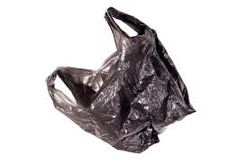

# Trash Bag Image Classification

<p align="center">
  
</p>

<p align="center">
  <a href="https://www.python.org/"></a>
  <a href="https://www.tensorflow.org/"></a>
  <a href="https://streamlit.io/"></a>
  
</p>

A computer vision project to classify bag-waste images into three categories:

- `Garbage Bag Images`
- `Paper Bag Images`
- `Plastic Bag Images`

This repository contains:

- End-to-end model development notebook
- Separate inference notebook
- Streamlit deployment app for EDA and prediction

## Live Demo

- Deployment: [Hugging Face Space](https://huggingface.co/spaces/HRifaldi/Garbage-Prediction)

## Project Highlights

- Multi-stage experimentation from baseline CNN to improved model
- Balanced dataset split across all classes
- Strong final performance from the best model
- Interactive deployment with:
  - dataset distribution analysis
  - random image preview by split
  - image upload prediction with confidence score

## Dataset

Source: [Kaggle - Plastic, Paper, Garbage Bag Synthetic Images](https://www.kaggle.com/datasets/vencerlanz09/plastic-paper-garbage-bag-synthetic-images)

### Class Distribution

| Split | Garbage Bag Images | Paper Bag Images | Plastic Bag Images | Total |
| --- | ---: | ---: | ---: | ---: |
| Train | 3,500 | 3,500 | 3,500 | 10,500 |
| Validation | 1,000 | 1,000 | 1,000 | 3,000 |
| Test | 500 | 500 | 500 | 1,500 |
| **Grand Total** | **5,000** | **5,000** | **5,000** | **15,000** |

## Modeling Summary

From the notebook experiments:

| Experiment | Approach | Test Accuracy |
| --- | --- | ---: |
| Baseline | Custom CNN (initial) | 0.65 |
| Improved | CNN + augmentation | 0.96 |
| Best Model | Transfer learning-based improvement | **0.97** |

> The best-performing model is exported for inference and deployment.

## Application Features

The Streamlit app includes two main pages:

1. `EDA`
- Dataset summary (total images, number of classes)
- Distribution chart by split and class
- Random image gallery

2. `Prediction`
- Upload an image (`jpg`, `jpeg`, `png`)
- Predict class label
- Show model confidence

## Project Structure

```text
.
|-- archive/
|-- dataset/
|   |-- train/
|   |-- val/
|   `-- test/
|-- deployment/
|   |-- app.py
|   |-- eda.py
|   |-- prediction.py
|   |-- requirements.txt
|   `-- model_inference.keras
|-- docs/
|   `-- assets/
|       `-- sample-inference.jpg
|-- P2G7_Hernanda_Rifaldi.ipynb
|-- P2G7_Hernanda_Rifaldi_inference.ipynb
|-- model_inference.keras
|-- url.txt
`-- README.md
```

## Run Locally

### 1. Create and activate virtual environment

```powershell
python -m venv .venv
.\.venv\Scripts\Activate.ps1
```

### 2. Install dependencies

```powershell
pip install -r deployment/requirements.txt
```

### 3. Configure dataset path for EDA page

The current EDA module uses an absolute local path in [`deployment/eda.py`](deployment/eda.py).

Update `DATASET_PATH` to your own project location, for example:

```python
DATASET_PATH = r"C:\path\to\your\project\dataset"
```

### 4. Run Streamlit app

```powershell
cd deployment
streamlit run app.py
```

## Notebook Files

- Training and experimentation: `P2G7_Hernanda_Rifaldi.ipynb`
- Inference testing: `P2G7_Hernanda_Rifaldi_inference.ipynb`

## Model and Resources

- Model (Hugging Face): [model_inference_1.keras](https://huggingface.co/spaces/HRifaldi/Garbage-Prediction/blob/main/model_inference_1.keras)
- Model (Google Drive): [Download Link](https://drive.google.com/file/d/1jSdiEa2IhmaxwYCRBL6LVb_EnxuiN5_X/view?usp=sharing)
- Deployment URL: [Garbage Prediction App](https://huggingface.co/spaces/HRifaldi/Garbage-Prediction)

## Tech Stack

- Python
- TensorFlow / Keras
- NumPy, Pandas
- Matplotlib
- Pillow
- Streamlit

## Future Improvements

- Add confusion matrix and class-wise metrics to deployment page
- Add model versioning and experiment tracking
- Remove hard-coded local paths with environment-based config
- Add API mode for external integration

## Author

**Hernanda Rifaldi**  
Hacktiv8 Data Science Fulltime Program
"# trash-garbage-classification" 
